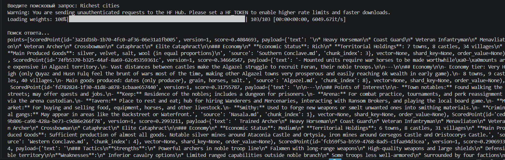

# architecture-RAG
YA PR sprint 7

## 1. Предлагаемое решение
Описано в файле plan.md

## 2. База знаний
Текстовые файлы находятся в папке knowledge_base
Взяты данные по игре Mount and Blade: Bannerlord, на всякий случай решил взять что-то не слишком популярное. 

Чистил нейросетью содержимое от html и приводил к читаемому форматированию. Замену делал через "найти-заменить" по проекту. Менял имена и названия. Где-то генерил рандомные слова, где-то просто буквы местами менял.

Данные лежат в папке knowledge_base, 33 документа.

## 3. Наполнение векторного храналища
1. Используемая модель - all-MiniLM-L6-v2'
2. База знаний - расписано в предыдущем пункте
3. Получилось 116 чанков, разбиение по токенам
4. Ответ генерируется ~4-5 секунд (локально на моем компьютере).

Для наполнения базы знаний должен быть установлен докер (для контейнера Qdrant) и следующие библиотеки (перевести на докер не было времени):
langchain-community 
langchain-qdrant 
langchain_text_splitters
sentence-transformers 
qdrant-client

Для наполнения БД выполнить скрипт data_insert.sh
Для того, чтобы проверить запрос к БД - запустить query.py, подождать инициализации, ввести запрос при появлении поля ввода.

Пример ответа на запрос:
